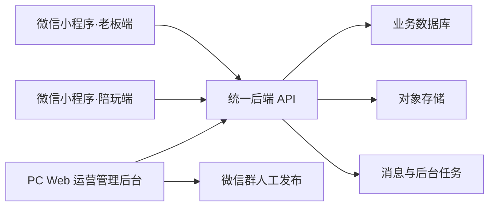
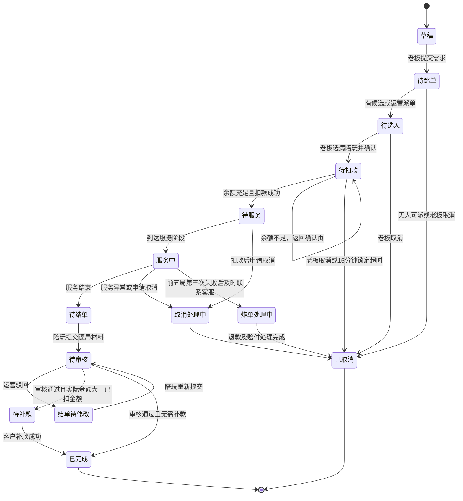

# 陪玩店微信小程序及运营管理后台产品需求文档

**文档版本：** V2.0  
**产品阶段：** 首版 MVP  
**更新日期：** 2026-08-04  
**适用产品：** 微信小程序、PC Web 运营管理后台、共享后端服务  
**文档状态：** 已确认规则可进入产品设计与技术设计；标记为“待确认”的事项不得固化为不可配置代码

---

## 1. 文档目的

本文档用于统一陪玩店微信小程序、PC Web 运营管理后台及共享后端的产品范围、业务规则、功能需求、数据结构和验收标准，作为原型设计、UI/UX 设计、技术方案、开发排期、测试验收和运营交接的共同依据。

V2.0 是需求文档版本，不代表产品已经进入第二个正式发布版本。产品交付范围仍以首版 MVP 为主。

本版已把业务负责人确认的账户、入驻、定价、储值、订单、结单、收入、包时、点单群和数据看板规则写入正文。尚未确认的取消违约、评价问卷、套餐价格、文件保留期限等事项统一收录于第 22 节。

## 2. 产品概述

### 2.1 产品定位

为陪玩店提供一套覆盖客户、陪玩和内部运营团队的数字化运营系统，完成以下闭环：

- 老板查看资产和陪玩资料、提交订单、选择陪玩、扣款、查看订单和评价服务；
- 陪玩查看跳单与本人订单、提交逐局结单材料、查看收入和规则文档；
- 运营审核陪玩、维护资料和价格、处理订单、审核结单、登记储值与资产、生成点单群文案；
- 财务查看资产流水、陪玩收入与结算批次，并记录线下打款结果；
- 全部客户端通过统一后端访问同一数据库，保证权限隔离、金额一致和操作可追溯。

### 2.2 产品形态

本项目最终确定建设两个客户端：

| 客户端 | 使用者 | 形态 | 主要用途 |
|---|---|---|---|
| 微信小程序 | 老板、陪玩 | 同一个小程序，按单一身份展示对应工作台 | 登录、资产、陪玩浏览、下单/跳单、订单、结单、收入和个人中心 |
| 运营管理后台 | 运营、财务、超级管理员 | PC Web | 用户、陪玩、价格、订单、资产、结算、点单文案、内容、数据看板和系统配置 |

同一微信账户只能拥有一个业务身份，不允许同时拥有老板和陪玩身份，也不提供身份切换。

### 2.3 总体架构

基本原则：

1. 客户端不得直接连接数据库或自行计算最终资产余额。
2. 余额、积分、存单、包时、数量型权益、订单收入和赔付扣款必须通过不可变流水变更。
3. 管理后台的资料、价格、金额和状态修改必须记录操作人、修改前后值、原因和时间。
4. 订单、财务和统计的事实来源为后端业务明细，不以微信群消息或客户端缓存为准。

## 3. 建设目标与核心指标

### 3.1 业务目标

- 将提交需求、跳单、选人、扣款、服务、结单、审核和收入结算线上化；
- 将老板余额、积分、存单、包时和数量型权益统一沉淀；
- 减少手工登记、错账、漏单和结单材料不一致；
- 建立可追溯的客户扣款、陪玩收入、平台分成、退款和赔付记录；
- 支持多个点单群的后续运营，同时保持单门店、单运营体系和统一价格规则；
- 为运营提供可执行的待办中心和经营数据看板。

### 3.2 首屏五项经营指标

V2.0 数据看板首屏固定展示：

| 指标 | 统计口径 |
|---|---|
| 完成订单数 | 统计周期内全部参与人结单审核通过、应付差额处理完成且订单进入“已完成”的订单数 |
| 成交金额 | 已完成订单最终确认的客户服务金额，不含已退款金额 |
| 储值金额 | 统计周期内由运营登记并生效的客户实际储值本金 |
| 毛利润 | 订单收入 + 现金礼物/权益收入 - 陪玩基础工资 - 绩效奖金 - 退款/赔付 - 优惠成本 - 其他直接支出 |
| 下单客户数 | 统计周期内至少有一笔已成立订单的去重老板数 |

所有指标显示统计周期、北京时间口径和计算说明。项目无历史数据，不建设历史数据导入功能。

## 4. 版本范围与优先级

### 4.1 优先级定义

| 优先级 | 含义 |
|---|---|
| P0 | 首版上线必须具备，缺失会导致核心业务无法闭环 |
| P1 | 首版后优先补充，明显提升运营效率或体验 |
| P2 | 后续增长或高级能力，独立评估后建设 |

### 4.2 MVP 范围

- 微信登录、单一身份注册、账户状态管理；
- 老板端与陪玩端的独立工作台；
- 陪玩入驻申请、运营审核、运营维护资料及价格；
- 陪玩浏览、收藏和历史合作记录；
- 提交需求、跳单、客户选人、余额扣款、服务、逐局结单、运营审核和订单完成；
- 通用余额、积分、存单、包时及数量型权益的展示、后台登记和流水；
- 陪玩基础工资、额外收入、绩效奖金、赔付扣款和线下打款记录；
- 评价入口、客观数据和公开评分；评价问卷规则需先关闭TODO-002；
- 后台生成适合微信群发布的点单文案与跳单链接；
- 公告、规则文档、消息、审计日志和五项核心经营指标。

### 4.3 MVP 不包含

- 微信支付、自动充值、自动退款和支付渠道对账；
- 同一微信账户的双重身份与身份切换；
- 会员等级、会员卡和等级成长体系；
- 陪玩在客户端自行修改职业资料；
- 自动向微信群发消息或从群内自动回写订单状态；
- 用户端客诉渠道；
- 多门店、多运营团队或多套价格体系；
- 历史数据导入；
- 复杂的自动排班、智能推荐和自动抢单。

## 5. 用户角色与权限

| 角色 | 定义 | 核心权限 |
|---|---|---|
| 老板 | 购买陪玩服务的客户 | 查看本人资产、浏览陪玩、提交需求、选人、扣款、查看本人订单、按规则评价 |
| 陪玩 | 提供王者荣耀陪玩服务的人员 | 查看本人资料、跳单、查看本人订单、提交结单、查看本人收入和制度 |
| 运营 | 负责日常业务运营 | 审核陪玩、维护资料与价格、管理点单群、处理订单、审核结单、登记资产和异常处理 |
| 财务 | 负责资金与结算 | 查看资产流水、处理高风险调整、生成结算批次、记录线下打款和对账 |
| 超级管理员 | 系统负责人 | 管理角色权限、系统参数、审计记录和高风险操作审批 |

权限原则：

- 老板只能访问本人账户、本人订单以及已公开的陪玩资料；
- 陪玩只能访问本人资料、本人参与的订单和本人收入；
- 陪玩资料由运营维护，陪玩客户端不提供编辑入口；
- 余额调整、退款、陪玩负余额调整、结算批次确认等高风险操作必须填写原因并保留审计记录；
- 超级管理员权限不得作为日常运营账号使用；
- 导出、批量调整和批量发放权益需单独授权。

## 6. 通用业务规则

### 6.1 账户规则

1. 系统为每个账户生成不可变内部 ID 和独立公开 ID，微信标识不得直接公开。
2. 同一微信身份只能绑定一个主账户和一个业务身份。
3. 老板注册后可直接使用；陪玩注册后进入“待审核”，审核通过后方可跳单和接单。
4. 账户支持正常、待审核、已驳回、已冻结和已停用状态。
5. 已冻结账户允许登录查看必要记录，但禁止新增交易或接单。
6. 用户若需要更换业务身份，由运营按注销原身份、处理未完成订单和资产后重新注册的线下流程处理，系统不提供直接切换。

### 6.2 金额与资产规则

1. 金额统一使用最小货币单位存储，禁止使用浮点数直接计算金额。
2. V2.0 不接入微信支付；储值、返现、扣款、退款和线下打款均由后台登记或由余额账本内部完成。
3. 客户资产至少分为通用余额、积分、存单、包时和数量型权益五类，彼此隔离。
4. 每笔充值、返现、积分发放、消费、退款、赠送、过期、赔付或人工调整均生成唯一流水。
5. 任何错误通过冲正处理，不物理删除原流水。
6. 客户通用余额不得为负；陪玩收入账户允许因补星赔付产生负数，并结转抵扣后续收入。
7. 所有财务写操作必须支持幂等，防止重复点击或任务重试造成重复入账。

### 6.3 定价与价格快照

陪玩档位沿用《报酬与结算补充协议》2.1 的五档标准：

| 档位 | 评定参考 | 综合定位 | 小时价格范围 | 局价格范围 |
|---|---|---|---:|---:|
| S+ | 巅峰积分 2400+ 或大国标 | 超顶尖技术陪 | 100–170 元/小时 | 35–60 元/局 |
| S | 巅峰积分 2200–2400 或小国标/热门英雄金标 | 顶尖技术陪 | 70–100 元/小时 | 25–35 元/局 |
| A+ | 巅峰积分 1900–2200 或金标/冷门英雄小国标 | 普通技术陪 | 40–70 元/小时 | 15–25 元/局 |
| A | 巅峰积分 1500–1900 或银标/铜标 | 普通娱乐陪 | 22–40 元/小时 | 8–15 元/局 |
| R | 巅峰积分 1200–1500 | 纯娱乐陪 | 12–22 元/小时 | 5–8 元/局 |

业务规则：

- 运营在陪玩入驻审核阶段为每名陪玩分别设置明确的小时价和局价；
- 价格必须位于该陪玩所属档位的允许范围内；
- 后续调价由运营执行，记录生效时间和原因；
- 老板下单时选择按局或按时计价；
- 订单成立时将计价方式、档位、单价和价格版本永久快照到订单参与人记录中；
- 历史订单不受后续调价影响。

### 6.4 陪玩收入与平台分成

1. 订单基础工资：陪玩获得最终可结算客户服务金额的 70%，俱乐部保留 30%。
2. 月度绩效奖金：按《绩效考核补充协议》计算，为当月客户付费总流水的 0%、10% 或 20%，与基础工资分开记账。
3. 现金冠名、守护和礼物：陪玩获得 80%，俱乐部获得 20%。
4. 储值套餐赠送的冠名或其他数量型权益不产生陪玩收入。
5. 结单审核通过且客户应付差额处理完成后，基础工资进入可结算状态：
   - 审核通过时间在当日 22:00 前：当日结算；
   - 审核通过时间在当日 22:00 后：顺延至次日 24:00 前结算。
6. 绩效奖金于次月 8 日结算。
7. 实际打款在线下完成，后台只记录结算批次、金额、操作人、打款时间和“已线下打款”状态。

### 6.5 月度绩效考核

绩效周期为自然月。陪玩签订合作协议的当月为过渡期，不参与绩效奖金；自次月1日起参与。离职当月不参与绩效奖金，仅结算基础工资。

基础项权重：

| 考核维度 | 技术型陪玩 | 娱乐型陪玩 |
|---|---:|---:|
| 游戏胜率 | 40% | 20% |
| 客户服务评价 | 30% | 50% |
| 接单效率 | 15% | 15% |
| 社群活跃度 | 15% | 15% |

计算规则：

1. **游戏胜率：**得分等于当月胜率百分数。技术型胜率低于50%时该项为0分，娱乐型低于40%时该项为0分；当月不足10局时统一按60分计算，不适用归零规则。
2. **客户服务评价：**得分等于当月好评率百分数。当月0单按60分；不足3单时按70分与实际好评率得分中的较高值。好评的问卷判定标准依赖TODO-002。
3. **接单效率：**技术型和娱乐型分组，按当月已完成订单客户流水排名。组内前20%得100分、20%–50%得75分、后50%得50分；当月0单得0分；组内参与排名少于3人时全员得100分。
4. **社群活跃度：**老板评价最多50分，监管人评价最多50分。监管人评价包含群内接单积极性0–20分、氛围带动能力0–15分、配合管理程度0–15分；后台支持运营录入依据与说明。
5. **绩效附加分：**包月每次15分、包周每次3分、包天每次0.5分、客户存单每4单1分、客户现金打赏/礼物每50元1分。附加分上不封顶。
6. **跨月包时：**按当月实际占用天数占套餐总天数的比例拆分附加分，保留两位小数并四舍五入；包天跨月时归入开始日所在月份。
7. **绩效总分：**各基础项得分乘以对应权重后求和，再加全部附加分；总分上不封顶。

奖金规则：

| 月度组内排名 | 奖金比例 | 奖金基数 |
|---|---:|---|
| 前10%（含） | 20% | 陪玩当月已完成服务的客户付费总流水 |
| 10%–50%（含） | 10% | 同上 |
| 后50% | 0% | 无绩效奖金 |

运营应于次月3日前公布上月绩效结果和明细。陪玩在收到结果后2个工作日内可申请复核，运营在收到申请后2个工作日内完成复核。无异议或复核完成后，绩效奖金于次月8日结算，并由后台记录线下打款。

排名分组、边界人数取整、同分并列和并列导致奖金名额溢出的处理方式尚待确认，见TODO-010。

### 6.6 时间与文件规则

- 数据库存储标准时间，业务端统一按北京时间展示；
- 订单记录计划开始时间、实际开始时间、实际结束时间和各状态时间；
- 包时按连续自然时间流逝，不按实际游戏时长暂停；
- 头像、自介资料、入驻录屏和结单截图存储于对象存储，数据库保存文件标识和受控访问地址；
- 文件类型、大小、数量和安全检查参数由技术设计确定；
- 头像/自介资料、结单截图和财务记录的保留期限待确认，系统需支持按文件类型配置保留期；
- 订单、流水、结算和审计记录不得由普通用户物理删除。

## 7. 游戏、人数与计价规则

### 7.1 支持范围

- V2.0 仅支持《王者荣耀》；
- 支持排位和匹配模式；
- 下单填写计划时间、模式、几陪几、位置需求、档位及人数、预计局数或预计时长；
- 一单最多包含 4 名陪玩。

### 7.2 “几陪几”组合

“n陪m”表示 n 名陪玩与 m 名老板/客户方玩家组队。

允许组合：

- 1陪1、1陪2、2陪1；
- 1陪3、2陪2、3陪1；
- 1陪4、2陪3、3陪2、4陪1。

结算映射：

| 实际组合 | 使用的结算标准 |
|---|---|
| 1陪3 | 1陪4 |
| 2陪2 | 2陪3 |
| 3陪1 | 3陪2 |
| 其他允许组合 | 使用《储值与结算》表中同名组合标准 |

### 7.3 多陪玩订单

- 一次客户需求建立一个主订单；
- 每名陪玩建立独立订单参与人记录；
- 单价、位置、收入、结单材料和审核状态按参与人分别记录；
- 主订单只有在全部参与人的结单处理完成、客户补款完成或退款处理完成后才能进入“已完成”。

## 8. 注册与陪玩入驻

### 8.1 注册流程

1. 用户发起微信登录；
2. 后端识别已有账户或进入新用户注册；
3. 新用户选择老板或陪玩身份，选择后不可在客户端切换；
4. 老板完成必要资料后直接进入老板端；
5. 陪玩填写申请资料、上传证明录屏并提交运营审核；
6. 审核通过后由运营补充自介卡、明确档位及小时价/局价，再开放跳单权限；
7. 审核驳回时展示原因，允许申请人重新提交入驻材料。

### 8.2 陪玩申请资料

| 类型 | 资料要求 | 展示范围 |
|---|---|---|
| 账户资料 | 头像、陪玩昵称、手机号 | 按字段公开或仅后台可见 |
| 实名资料 | 真实姓名、身份信息 | 仅有权限的后台人员可见 |
| 职业定位 | 技术型/娱乐型、擅长位置、常用英雄、文字自介、语音介绍 | 审核通过后按规则公开 |
| 游戏能力证明 | 一段连续录屏 | 仅后台审核使用 |
| 可接信息 | 可接单日期、时段或运营备注 | 陪玩本人和运营可见 |

不要求陪玩提交王者荣耀区服和游戏昵称，也不接受静态截图替代能力证明录屏。

录屏必须：

1. 从游戏登录界面开始；
2. 展示登录本人账号的过程或可确认本人账号的信息；
3. 连续展示英雄标、当前段位、巅峰积分等评定所需界面；
4. 不得剪辑、拼接或遮挡关键评定信息。

### 8.3 资料维护

- 陪玩客户端仅展示资料，不提供修改入口；
- 自介卡图片不由陪玩提交，审核通过后由运营后台上传；
- 陪玩如需修改昵称、定位、英雄、语音、自介或证明材料，需联系客服/运营；
- 所有后台修改记录修改前后值、操作人、原因和时间；
- 涉及档位和价格的修改必须创建新版本并设置生效时间。

## 9. 微信小程序——老板端

### 9.1 信息架构

建议底部导航：

1. 首页：活动、常用入口、推荐陪玩；
2. 陪玩：全部、合作过、收藏；
3. 下单：创建和查看当前需求；
4. 订单：进行中、待处理、已完成、已取消；
5. 我的：资料、资产、权益、消息和规则。

### 9.2 个人资料

| 编号 | 功能 | 需求说明 | 优先级 |
|---|---|---|---|
| CUS-001 | 基础信息 | 展示并按规则维护头像、昵称、性别和公开账户 ID | P0 |
| CUS-002 | 游戏偏好 | 维护常用位置、英雄、希望称呼和服务偏好 | P0 |
| CUS-003 | 板卡 | 展示运营配置的老板板卡；允许查看原图 | P1 |
| CUS-004 | 数量型权益 | 查看小窝、群冠、个冠、冠卡、守护星、板卡、表情包和定制礼物单数量 | P0 |

### 9.3 资产中心

系统不设会员等级和会员卡。

| 编号 | 功能 | 需求说明 | 优先级 |
|---|---|---|---|
| WAL-001 | 通用余额 | 展示可用余额和最近变动；以账本汇总为准 | P0 |
| WAL-002 | 余额流水 | 展示业务类型、关联订单、变动额、变动后余额、时间和说明 | P0 |
| WAL-003 | 单次储值套餐 | 展示 288、520、888 等后台配置的套餐及返现、积分和赠送权益；V2.0 不支持在线购买 | P0 |
| WAL-004 | 返现 | 运营登记储值生效时，返现金额直接进入通用余额并生成流水 | P0 |
| WAL-005 | 积分 | 展示积分余额和流水；1积分按1元礼物单消费价值计算，与通用余额隔离且永久有效 | P0 |
| WAL-006 | 礼物单结算 | 允许100%积分抵扣，也允许积分与通用余额组合扣减；礼物成交后不可退款 | P0 |
| WAL-007 | 存单 | 展示绑定陪玩、单位类型、总量、已用/剩余量、生效/到期时间和状态 | P0 |
| WAL-008 | 包时 | 展示包天/包周/包月、绑定陪玩、开始/结束时间和状态 | P0 |
| WAL-009 | 数量型权益 | 仅记录和展示各类权益数量与增减流水，不在V2.0解释线下使用流程 | P0 |

### 9.4 陪玩浏览

| 编号 | 功能 | 需求说明 | 优先级 |
|---|---|---|---|
| PLY-001 | 全部陪玩 | 展示已审核、已上架且允许公开的陪玩 | P0 |
| PLY-002 | 搜索筛选 | 按昵称/ID、档位、位置、英雄、评分和接单状态筛选 | P1 |
| PLY-003 | 陪玩详情 | 展示头像、自介卡、语音、档位、明确单价、位置/英雄、当月与历史评分、胜率和当前状态 | P0 |
| PLY-004 | 合作过 | 根据已完成订单生成合作过的陪玩列表 | P1 |
| PLY-005 | 收藏 | 收藏/取消收藏，并在收藏列表查看 | P1 |
| PLY-006 | 隐私 | 不展示真实姓名、身份证明、手机号、录屏等后台字段 | P0 |

### 9.5 下单

| 编号 | 功能 | 需求说明 | 优先级 |
|---|---|---|---|
| ORD-001 | 自动带入 | 自动带入老板公开 ID、昵称和已保存偏好，提交前可修改本单信息 | P0 |
| ORD-002 | 需求信息 | 选择模式、几陪几、位置、档位及数量、计划时间、按局/按时、预计局数/时长 | P0 |
| ORD-003 | 指定陪玩 | 可指定陪玩；不可用时进入等待，老板可在订单成立前随时取消 | P0 |
| ORD-004 | 跳单候选 | 未直接指定或需要多人时，展示符合条件且已跳单的候选陪玩 | P0 |
| ORD-005 | 选人 | 老板选满所需陪玩人数后进入确认订单 | P0 |
| ORD-006 | 价格确认 | 展示每名陪玩价格快照、预计数量、预计总额和资产抵扣 | P0 |
| ORD-007 | 余额扣款 | 老板确认后执行余额扣款；扣款成功才视为订单成立 | P0 |
| ORD-008 | 余额不足 | 返回确认订单页；运营补足余额后，老板刷新余额并重新确认扣款 | P0 |
| ORD-009 | 候选锁定 | 进入确认订单后锁定已选陪玩15分钟；超时未扣款自动释放 | P0 |
| ORD-010 | 防重复 | 连续点击或网络重试不得生成重复订单或重复扣款 | P0 |
| ORD-011 | 订单进度 | 展示待跳单、待选人、待扣款、待服务、服务中、待结单、待审核、待补款、已完成等状态 | P0 |
| ORD-012 | 取消 | 余额扣款前允许取消；扣款后的取消与违约规则待确认 | P0 |

### 9.6 历史订单与评价

| 编号 | 功能 | 需求说明 | 优先级 |
|---|---|---|---|
| HIS-001 | 订单列表 | 按进行中、待处理、待评价、已完成和已取消分类 | P0 |
| HIS-002 | 订单详情 | 展示订单号、人员、时间、费用、资产变动、状态时间线和逐局结算结果 | P0 |
| REV-001 | 评价入口 | 仅已完成订单可对每名陪玩分别评价；具体问卷待确认 | P0 |
| REV-002 | 客观数据 | 胜率、局内评分等由审核通过的对局记录自动生成 | P0 |
| CMP-001 | 客诉 | V2.0不提供用户端客诉入口；仅保留联系客服方式 | P2 |

## 10. 微信小程序——陪玩端

### 10.1 信息架构

建议底部导航：

1. 工作台：接单状态、跳单入口和待办；
2. 订单：待选结果、待服务、服务中、待结单、审核驳回和已完成；
3. 数据：收入、胜率、评分和绩效；
4. 我的：只读职业资料、规则文档、公告和客服入口。

### 10.2 工作台与资料

| 编号 | 功能 | 需求说明 | 优先级 |
|---|---|---|---|
| COM-001 | 陪玩 ID | 展示唯一陪玩编号、档位、定位和账户状态 | P0 |
| COM-002 | 接单状态 | 审核通过后切换可接单/休息中；包时有效期间强制为不可接其他老板订单 | P0 |
| COM-003 | 待办 | 汇总跳单结果、即将开始、待结单、审核驳回和待确认异常 | P0 |
| COM-004 | 资料展示 | 展示运营维护的头像、自介卡、语音、位置/英雄、档位和价格 | P0 |
| COM-005 | 禁止编辑 | 客户端不提供职业资料编辑；提供联系客服入口 | P0 |

### 10.3 订单与结单

| 编号 | 功能 | 需求说明 | 优先级 |
|---|---|---|---|
| COM-010 | 跳单 | 在有效跳单时间内报名成为候选人；跳单不代表订单已分配 | P0 |
| COM-011 | 订单列表 | 查看本人参与订单及状态 | P0 |
| COM-012 | 老板信息 | 仅展示履约所需的昵称、称呼、偏好和板卡，不展示敏感信息 | P0 |
| COM-013 | 提交结单 | 先选择本次对局总数，系统按数量生成逐局列表 | P0 |
| COM-014 | 逐局资料 | 每局填写输/赢、本人位置、本人评分并上传对应截图 | P0 |
| COM-015 | 审核驳回 | 查看驳回原因，修改材料后重新提交 | P0 |
| COM-016 | 完成详情 | 查看审核结果、合格局数、费用计算、基础工资和调整项 | P0 |

### 10.4 收入

| 编号 | 功能 | 需求说明 | 优先级 |
|---|---|---|---|
| INC-001 | 收入账户 | 展示待审核、待客户补款、可结算、已结算和负余额 | P0 |
| INC-002 | 收入明细 | 展示来源、关联订单/权益、客户金额、分成比例、陪玩金额和状态 | P0 |
| INC-003 | 基础工资结算 | 按第6.4节的22点截止规则更新结算状态 | P0 |
| INC-004 | 绩效奖金 | 展示自然月考核结果、排名、奖金比例和次月8日结算记录 | P1 |
| INC-005 | 线下打款 | 展示后台确认的线下打款批次和时间，不在小程序发起提现 | P0 |
| INC-006 | 赔付扣款 | 展示炸单补星赔付及均摊扣款，允许账户余额为负 | P0 |

## 11. PC Web 运营管理后台

### 11.1 数据看板与待办

| 编号 | 功能 | 需求说明 | 优先级 |
|---|---|---|---|
| BI-001 | 核心指标 | 展示完成订单数、成交金额、储值金额、毛利润和下单客户数 | P0 |
| BI-002 | 趋势 | 按日/周/月展示核心指标趋势；无历史导入 | P1 |
| BI-003 | 待办中心 | 展示待审核陪玩、待派单、待结单审核、待补款、结算到期和财务异常 | P0 |
| BI-004 | 点单群筛选 | 支持按点单群查看订单和陪玩，预留多群运营 | P0 |

### 11.2 老板与资产管理

- 按公开 ID、昵称、状态、注册时间、储值或消费区间查询；
- 查看基础资料、余额、积分、存单、包时、数量型权益、订单和操作记录；
- 登记单次储值套餐，自动计算返现、积分和赠送权益；
- 对余额、积分、存单、包时和数量型权益执行有原因、有凭证、有流水的调整；
- 冻结、解冻、备注和风险标记必须记录原因。

### 11.3 陪玩审核与管理

| 编号 | 功能 | 需求说明 | 优先级 |
|---|---|---|---|
| ADM-P01 | 申请审核 | 查看申请资料和连续录屏，支持通过、驳回和要求补充 | P0 |
| ADM-P02 | 档位评定 | 设置技术/娱乐定位、R/A/A+/S/S+档位 | P0 |
| ADM-P03 | 价格设置 | 设置明确小时价和局价，校验档位范围并创建价格版本 | P0 |
| ADM-P04 | 自介卡 | 审核通过后由运营上传、替换和下架自介卡 | P0 |
| ADM-P05 | 资料维护 | 代陪玩修改公开资料；所有修改留审计记录 | P0 |
| ADM-P06 | 上下架与封禁 | 控制目录可见性、跳单和接单权限 | P0 |
| ADM-P07 | 表现统计 | 展示订单、胜率、评分、收入、绩效和赔付记录 | P1 |

### 11.4 订单中心

- 按日期、状态、老板、陪玩、点单群、金额和异常类型检索；
- 查看跳单候选、选人结果、15分钟锁定时间和扣款结果；
- 运营可在无人跳单时手工派单，但不得绕过档期、包时锁定和账户状态校验；
- 价格、人员和时间修改必须保留完整版本记录；
- 结单审核只能“通过”或“驳回”，运营不得直接替陪玩修改逐局材料；
- 驳回必须填写具体原因；陪玩修改后产生新版本并重新进入审核；
- 运营应在陪玩提交后24小时内完成审核；
- 审核通过后的错误通过冲正处理，不覆盖原结单和原流水；
- 支持炸单关闭、补星数量确认、代练市场价录入、退款和陪玩均摊扣款；
- 支持预计金额与实际金额的多退少补及待补款处理。

### 11.5 财务与结算

- 通用余额、积分、存单、包时、数量型权益和陪玩收入使用独立账本；
- 生成陪玩基础工资到期任务，执行22点截止规则；
- 按月生成绩效考核和次月8日奖金结算记录；
- 冠名、守护、现金礼物按80%/20%自动拆分；
- 套餐赠送权益不生成陪玩收入；
- 补星赔付均摊可使陪玩账户为负，后续收入自动抵扣；
- 财务按批次记录“已线下打款”，禁止伪造在线支付状态；
- 按订单核对客户扣款、退款、陪玩工资、绩效奖金、额外收入、赔付和毛利润。

### 11.6 点单群文案

Bot上线前，后台为每笔待跳单需求生成可复制的微信群文字，至少包含：

- 订单/需求编号；
- 计划开始时间；
- 游戏模式与“几陪几”；
- 位置、档位及人数要求；
- 按局/按时及预计数量；
- 必要备注；
- 陪玩端跳单页面链接；
- 跳单截止时间。

运营点击“复制文案”后手工转发至对应点单群。系统记录生成时间、文案版本、复制人和所属点单群，但不把“已复制”视为“已发送成功”。

### 11.7 系统配置

- 管理员、角色和操作权限；
- 点单群配置及陪玩所属群；
- 游戏模式、位置、英雄、档位范围和价格版本；
- 单次储值套餐、返现、积分和数量型权益模板；
- 存单及包时模板、有效期和价格；
- 结单审核时限、跳单时限、候选锁定时长；
- 文件存储、保留期限和消息模板；
- 操作日志、接口异常和后台任务记录。

## 12. 核心订单流程

### 12.1 主状态流程

### 12.2 下单与人工群发布

1. 老板填写需求并提交，系统创建待跳单记录。
2. 后台生成微信群文案和跳单链接，运营复制并转发到所属点单群。
3. 符合账户、档位、档期和包时限制的陪玩可在有效期内跳单。
4. 跳单仅表示成为候选人，不代表已经获得订单。
5. 老板查看候选资料并选满人数；指定陪玩不可用时保持等待，老板可取消。
6. 选满后系统按每名陪玩的有效价格和预计局数/时长生成预计金额，并锁定陪玩15分钟。
7. 老板确认扣款：
   - 余额充足：立即扣款，订单成立并进入待服务；
   - 余额不足：不成立订单，返回确认页。运营补足余额后，老板刷新并重新确认；
   - 锁定超时：释放陪玩，老板需重新选人。
8. 正式成立前取消不收取费用。

### 12.3 实际金额多退少补

- 下单时扣除预计金额；
- 结单审核后实际金额低于预计金额，差额自动退回原客户资产并生成退款流水；
- 实际金额高于预计金额，系统生成补款项并从通用余额扣除；
- 补扣时余额不足，订单进入“待补款”，陪玩收入暂不进入可结算；
- 运营补足余额后由老板刷新并完成补款；
- 订单完成后保留预计金额、最终金额、退款/补款和全部流水。

## 13. 结单与审核规则

### 13.1 陪玩提交

1. 每名陪玩分别提交本人的结单材料。
2. 陪玩先选择本次对局总数。
3. 系统生成相同数量的逐局列表。
4. 每局必填：输/赢、本人位置、本人评分、对应对局截图。
5. 提交后生成不可变版本，后续修改产生新版本。

### 13.2 运营审核

- 运营核对对局数量、结果、位置、评分和截图一致性；
- 内容不符时必须驳回并说明具体局次和原因；
- 陪玩修改后再次提交，重复审核流程；
- 运营不能直接修改陪玩提交的事实字段；
- 正常审核时限为提交后24小时；
- 审核通过后若发现错误，只能通过后台冲正并保留原结单、原审核和原流水；
- 全部参与人审核通过且客户差额处理完成后，订单进入已完成。

### 13.3 档位与组合结算标准

“结赢/评分达到阈值”表示满足任一条件即可；“评分前二”按本方五人排名判断。

| 档位/模式 | 1陪1 | 1陪4 | 1陪2 / 2陪3 | 3陪2 / 2陪1 | 4陪1 |
|---|---|---|---|---|---|
| R / A / 匹配 | 不论胜负均结算，且适用于全部允许组合 | 同左 | 同左 | 同左 | 同左 |
| A+ | 结赢或评分≥9.5 | 胜负均结 | 结赢或本方评分前二 | 结赢或本方评分前二 | 只结赢；胜率低于50%不结 |
| S | 结赢或评分≥10.0 | 结赢或本方评分前二 | 结赢或败方MVP | 结赢或败方MVP | 只结赢；30星以下胜率低于70%不结 |
| S+ | 结赢或评分≥10.0 | 结赢或败方MVP | 结赢，或同时满足败方MVP且评分≥10.0 | 只结赢；胜率低于50%不结 | 只结赢；50星以下胜率低于70%不结，50星及以上胜率低于50%不结 |

补充规则：

- R/A 为娱乐陪，A+及以上为技术陪；
- 娱乐陪与技术陪混合时，按技术陪对应的“n陪多”标准判断；
- 多个不同档位技术陪混合时，各陪玩按本人档位的1陪1标准判断；
- 某局“不结”表示该局客户不扣费且陪玩无工资；
- 不合格局产生的退款和收入冲减必须分别生成流水。

### 13.4 炸单

炸单定义：订单开始后，前五局内累计失败三局。

处理流程：

1. 第三局失败结束后，客户和陪玩必须立即停止继续对局并联系客服；
2. 运营核验后在后台关闭订单并标注“炸单”；
3. 整张订单0结，退回本单已扣的通用余额；使用存单或包时的，恢复相应局数或时长；
4. 运营确认补星数量，并按当时的代练市场价录入赔付金额；
5. 赔付金额由本单全部结单陪玩平均分摊，从陪玩收入账户直接扣除；
6. 陪玩账户不足时允许变为负数，后续收入自动抵扣；
7. 若第三次失败后未及时停止并联系客服，整单按正常规则结算，不适用炸单0结和补星赔付。

## 14. 存单、包时与数量型权益

### 14.1 存单

- 存单以局数或小时数为单位，创建时必须明确单位类型；
- 存单绑定指定老板和指定陪玩；
- 不可转让给其他老板，不可更换绑定陪玩；
- 不可拆分成多个独立存单，但允许分次消耗；
- 每次使用产生明细，并维护总量、已用量和剩余量；
- 有效期为自生效时间起一个月；
- 退款金额为剩余局数/小时数对应价值的70%；
- 退款后相应剩余量作废，保留原存单和退款流水；
- 存单的发放/购买方式和定价仍待确认，后台需支持配置。

### 14.2 包时

| 类型 | 连续自然时长 |
|---|---:|
| 包天 | 24小时 |
| 包周 | 7天 |
| 包月 | 30天 |

业务规则：

- 包时绑定指定老板和指定陪玩；
- 套餐价格待确认，由后台独立配置并保留版本；
- 运营明确设置开始时间和结束时间；
- 生效期间按自然时间连续流逝，不因老板休息、未下单或未游戏而暂停；
- 生效期间陪玩完全禁止接受其他老板订单，系统从跳单和派单资格中排除；
- 具体服务时间和内容由老板与陪玩在微信点单群内沟通，小程序不记录逐次服务安排；
- 请假、掉线、不可服务等特殊情况由客服/运营处理，可执行暂停、顺延、提前结束或其他人工调整；
- 每次人工调整必须填写原因并保留开始/结束时间的修改记录。

### 14.3 数量型权益

以下权益在V2.0仅作为客户资产数量记录：

- 小窝；
- 群冠；
- 个冠；
- 冠卡；
- 守护星；
- 板卡；
- 表情包；
- 定制礼物单。

系统支持发放、扣减、过期/作废（如后续配置）、备注和流水，不在本版本内解释其线下使用方式。冠名兑换关系可由后台配置，例如个冠兑换冠卡、冠卡兑换守护星、群冠兑换全群冠等。

## 15. 评价与客诉

### 15.1 已确认评价边界

- 只有审核完成的结单记录才能生成胜率、平均局内评分等客观指标；
- 老板评价有效期为订单完成所在自然月内，自当月1日起至下月1日00:00前；
- 陪玩详情支持当月和历史两个评分视图；
- 历史值为账号创立以来各自然月评分的均值；
- 所有老板账户可查看任意已上架陪玩的公开评分；
- 陪玩之间不可查看彼此评分；
- 陪玩对评分有异议时通过客服联系运营；
- 后台更正必须记录原值、新值、原因和操作人。

评价问卷维度、雷达图轴、匿名方式和文字评价公开范围仍待确认。在规则关闭前，评价功能不得以临时字段直接上线。

### 15.2 客诉

V2.0不建设用户端客诉渠道。老板和陪玩通过现有客服方式沟通，运营使用订单备注和审计日志记录必要处理。

完整客诉分类、处理时限、赔付权限、陪玩处罚、申诉和凭证保留规则列为P2独立需求。

## 16. 点单群与Bot边界

### 16.1 V2.0人工流程

- 点单群平台为微信；
- 后台生成标准化文字和跳单页面链接；
- 运营复制后手工转发至对应点单群；
- 微信群消息不是订单事实来源；
- 后台记录所属点单群、文案版本和复制记录；
- 文案生成失败不得影响需求入库，运营可手工查看并重试生成。

### 16.2 后续Bot

Bot的自动发群、群内交互、身份校验、状态回写、技术路线、合规性、失败重试和上线计划另建独立需求文档。后端应通过独立适配层和订单事件接口预留扩展点，但V2.0验收不依赖Bot上线。

## 17. 状态定义

### 17.1 账户与陪玩状态

| 对象 | 状态 | 说明 |
|---|---|---|
| 账户 | 正常 | 可使用对应单一身份功能 |
| 账户 | 待审核 | 陪玩申请等待审核，不可跳单 |
| 账户 | 已驳回 | 可按原因重新提交申请材料 |
| 账户 | 已冻结 | 可查看必要记录，禁止新增交易/跳单 |
| 账户 | 已停用 | 停止正常业务功能 |
| 陪玩接单 | 休息中 | 不进入跳单和派单范围 |
| 陪玩接单 | 可接单 | 满足档期和规则时可以跳单 |
| 陪玩接单 | 已锁定 | 被客户选中，处于15分钟扣款锁定 |
| 陪玩接单 | 服务中 | 至少有一笔正在履约的订单 |
| 陪玩接单 | 包时占用 | 包时生效，禁止其他老板订单 |

### 17.2 订单状态

| 状态 | 是否已成立 | 允许动作 |
|---|---|---|
| 草稿 | 否 | 老板编辑、提交或删除 |
| 待跳单 | 否 | 陪玩跳单、运营派单、老板取消 |
| 待选人 | 否 | 老板选人、取消 |
| 待扣款 | 否 | 老板确认扣款、刷新余额、取消；超时释放陪玩 |
| 待服务 | 是 | 查看详情、按待确认规则申请取消 |
| 服务中 | 是 | 履约、异常上报、进入炸单处理 |
| 待结单 | 是 | 陪玩提交逐局材料 |
| 待审核 | 是 | 运营通过或驳回 |
| 结单待修改 | 是 | 陪玩修改并重新提交 |
| 待补款 | 是 | 老板补款，收入暂不可结算 |
| 取消处理中 | 是 | 运营计算退款、扣款和责任 |
| 炸单处理中 | 是 | 运营核验、退款、确认补星及陪玩扣款 |
| 已完成 | 是 | 查看最终明细、按规则评价 |
| 已取消 | 否/曾成立 | 查看取消原因、退款和赔付结果 |

### 17.3 资产与收入状态

| 对象 | 状态流 |
|---|---|
| 存单 | 待生效 → 可用 → 部分使用 → 已用完 / 已过期 / 已退款 / 已作废 |
| 包时 | 待生效 → 生效中 → 已暂停 / 已结束 / 已作废 |
| 结单 | 待提交 → 待审核 → 待修改 → 已通过 / 已冲正 |
| 陪玩收入 | 待审核 → 待客户补款 → 可结算 → 已结算；赔付可形成负余额 |
| 线下打款 | 待生成 → 待确认 → 已线下打款 → 已冲正 |

## 18. 数据模型建议

| 实体 | 关键字段 | 说明 |
|---|---|---|
| 用户账户 `users` | 用户ID、微信标识、公开ID、单一角色、状态 | 不支持一人双身份 |
| 老板资料 `customer_profiles` | 用户、昵称、头像、偏好、板卡 | 与通用账户一对一 |
| 陪玩申请 `companion_applications` | 申请人、实名资料、定位、录屏、审核状态 | 保存每次提交和审核版本 |
| 陪玩资料 `companion_profiles` | 陪玩ID、档位、自介、语音、英雄/位置、上架状态 | 仅后台修改 |
| 陪玩媒体 `companion_media` | 类型、文件、版本、审核信息 | 自介卡、语音、证明录屏 |
| 陪玩价格 `companion_price_versions` | 陪玩、档位、小时价、局价、生效时间 | 订单引用价格版本 |
| 点单群 `order_groups` | 群ID、名称、状态、配置 | 支持未来多群 |
| 陪玩群关系 `companion_groups` | 陪玩、点单群、生效期 | 一名陪玩可按配置关联群 |
| 需求单 `order_requests` | 客户、群、需求、跳单截止、状态 | 正式订单前的需求事实 |
| 跳单候选 `order_candidates` | 需求、陪玩、报名时间、资格结果 | 跳单不等于接单 |
| 主订单 `orders` | 订单号、客户、状态、计划/实际时间、金额汇总 | 扣款成功后标记成立 |
| 订单参与人 `order_companions` | 订单、陪玩、位置、价格快照、收入、审核状态 | 支持一单多陪玩 |
| 订单状态日志 `order_status_logs` | 前后状态、操作者、原因、时间 | 不可变时间线 |
| 对局记录 `game_sessions` | 参与人、局次、输赢、位置、评分、合格结果 | 每名陪玩逐局记录 |
| 结单材料 `settlement_evidence` | 参与人、局次、文件、版本、审核结果 | 驳回后保留旧版本 |
| 费用项 `order_amount_items` | 类型、金额、方向、对象、关联资产 | 预计、最终、退款、补款、工资、赔付等 |
| 通用钱包 `wallet_accounts` | 所有人、可用额、状态、版本 | 客户余额不得为负 |
| 钱包流水 `wallet_transactions` | 流水号、类型、金额、前后值、幂等键 | 不可物理删除 |
| 积分账户 `point_accounts` | 客户、可用积分 | 与余额隔离 |
| 积分流水 `point_transactions` | 发放、礼物消费、冲正 | 永不过期，礼物不退款 |
| 储值套餐 `topup_plans` | 本金、返现、积分、权益、版本 | 仅后台登记生效 |
| 存单 `deposit_vouchers` | 客户、陪玩、单位、总量、剩余量、单价、到期时间 | 可分次使用，不可转让 |
| 包时 `time_packages` | 客户、陪玩、类型、价格、开始/结束、状态 | 生效期间阻止其他订单 |
| 权益库存 `benefit_balances` | 客户、权益类型、数量 | 只做数量管理 |
| 权益流水 `benefit_transactions` | 来源、增减量、业务关联 | 套餐赠送不生成陪玩收入 |
| 陪玩收入 `companion_earnings` | 陪玩、来源、应得金额、状态、可结算时间 | 支持负余额抵扣 |
| 结算批次 `payout_batches` | 周期、陪玩、金额、线下打款状态 | 记录实际线下打款 |
| 绩效记录 `performance_records` | 自然月、维度、排名、比例、奖金 | 次月8日结算 |
| 评价 `reviews` | 订单、老板、陪玩、维度、文字、展示状态 | 字段待问卷确认 |
| 内容 `contents` | 公告、活动、制度、上下线状态 | 面向不同角色发布 |
| 审计日志 `audit_logs` | 操作人、对象、前后值、原因、IP/设备、时间 | 高风险操作长期留痕 |

一致性要求：

- 订单号、流水号和结算批次号全局唯一；
- 状态变更使用版本号或乐观锁，防止并发覆盖；
- 扣款、退款、补款、收入和赔付使用同一业务事务或可靠最终一致机制；
- 统计字段必须可以从订单、对局和流水明细重算；
- 已完成订单的收入、成本和毛利润必须能追溯到费用项；
- 软删除不得破坏订单、资产、结算和审计链路。

## 19. API、消息与非功能要求

### 19.1 API 原则

- 统一版本前缀，例如 `/api/v1`；文档升级至V2.0不自动构成API破坏性升级；
- 登录后由服务端根据单一身份和账户状态鉴权；
- 列表接口支持分页、筛选和排序；
- 创建需求、扣款、退款、结单提交、审核、资产调整和结算任务必须支持幂等键；
- 客户端只能提交业务动作，不能直接指定任意目标状态；
- 对外 DTO 不返回实名资料、手机号、录屏存储地址等敏感字段；
- 点单群文案生成通过独立接口实现，为后续Bot适配预留事件和回调边界。

### 19.2 消息通知

| 事件 | 老板 | 陪玩 | 运营/财务 |
|---|---|---|---|
| 需求提交 | 提交成功 | 跳单入口 | 文案生成和待发布提醒 |
| 选人/锁定 | 锁定倒计时 | 被选结果 | 超时或资格异常 |
| 扣款 | 成功/余额不足 | 订单成立 | 财务异常提醒 |
| 即将开始 | 时间提醒 | 时间提醒 | 未开始异常 |
| 结单提交 | 待审核 | 提交成功 | 待审核提醒 |
| 审核 | 结果与多退少补 | 通过/驳回及收入 | 超过24小时告警 |
| 炸单 | 退款和补星结果 | 赔付扣款 | 待处理和负余额告警 |
| 资产变化 | 余额/积分/权益流水 | 收入/扣款流水 | 大额或异常调整 |
| 线下打款 | 不适用 | 打款状态 | 待确认批次 |

### 19.3 安全、性能与可用性

- 微信登录态、后台管理员会话和敏感操作采用合理过期与二次校验；
- 实名资料、录屏、结单截图使用受控访问地址，不使用永久公开链接；
- 后台按最小权限展示敏感字段，并记录查看和导出行为；
- 金额、身份、价格和状态接口必须进行服务端校验；
- 常用列表在正常网络下目标响应时间不高于2秒，复杂报表允许异步生成；
- 文件上传支持断点重试或失败重试提示，不得因重复提交生成多份业务记录；
- 定时结算、绩效计算和消息任务支持重试、幂等、告警和人工补偿；
- 数据库定期备份并验证恢复；RPO、RTO和保留周期在上线前确定。

## 20. 埋点与经营报表

### 20.1 关键埋点

- 登录、注册身份选择、陪玩申请提交和审核结果；
- 陪玩浏览、筛选、收藏、提交需求、跳单和选人；
- 进入确认订单、余额不足、扣款成功、锁定超时；
- 服务状态、结单提交、驳回、重新提交和审核通过；
- 退款、补款、炸单、补星赔付和负余额；
- 储值登记、返现、积分、存单、包时和数量型权益变化；
- 点单文案生成、复制和失败；
- 线下打款批次确认。

### 20.2 经营报表

- 五项首屏指标及日/周/月趋势；
- 订单漏斗：提交需求 → 有候选 → 选人 → 扣款 → 服务 → 结单 → 审核 → 完成；
- 陪玩表现：订单量、胜率、局内评分、基础工资、额外收入、绩效和赔付；
- 客户资产：储值本金、返现、消费、积分、存单、包时和权益数量；
- 异常报表：锁定超时、待补款、结单审核超时、炸单、负余额、资产差异和结算逾期；
- 点单群维度：需求数、跳单人数、订单成立数和完成金额。

## 21. 验收标准与实施阶段

### 21.1 P0业务闭环验收

1. 同一微信账户只能注册一个业务身份，无法在客户端切换身份。
2. 陪玩能提交规定资料和连续录屏；运营能审核、维护自介卡、档位和明确价格。
3. 陪玩无法通过客户端修改职业资料。
4. 老板能创建王者荣耀需求，并选择全部允许的“几陪几”组合，单笔最多4名陪玩。
5. 后台能生成微信群文案和跳单链接，运营可复制发布。
6. 跳单、选人、15分钟锁定、余额扣款和余额不足返回流程均可正确执行。
7. 扣款成功前订单不成立，且不得重复扣款。
8. 陪玩能按对局数提交逐局输赢、位置、评分和截图。
9. 运营只能通过或驳回结单；驳回修改保留版本；审核后更正通过冲正处理。
10. 系统能按档位、组合和逐局条件判断可结算局，并对不结局同时取消客户费用和陪玩工资。
11. 系统能执行预计金额与最终金额的多退少补；余额不足时进入待补款并暂停陪玩收入结算。
12. 炸单能完成整单退款、补星价格登记、陪玩均摊扣款和负余额结转。
13. 基础工资按70%和22点截止规则结算，现金额外收入按80%入账，绩效奖金于次月8日生成。
14. 后台能记录“已线下打款”，且所有金额可追溯到流水和订单。
15. 存单能分次消耗、一个月到期并按剩余价值70%退款。
16. 包时生效期间，陪玩不能跳单或被派给其他老板。
17. 通用余额、积分、存单、包时和数量型权益互不覆盖。
18. 数据看板正确展示五项核心指标，不依赖历史数据导入。

### 21.2 权限与数据验收

- 老板不能访问他人资产和订单；
- 陪玩不能访问他人订单、收入、评分或录屏；
- 未授权后台账号不能查看实名资料、执行财务调整或导出数据；
- 每笔高风险操作包含操作人、原因、前后值和时间；
- 订单、流水、结单和结算记录不可被普通操作物理删除；
- 并发和重复请求不会生成重复订单、扣款、退款或收入；
- 已完成订单的最终金额、陪玩收入和毛利润可由明细重算。

### 21.3 建议实施阶段

**阶段0：规则关闭与原型**

- 关闭第22节P0待办；
- 完成角色、资产、订单、结单和后台原型；
- 确认字段、状态、权限和审计范围。

**阶段1：账户、陪玩和订单核心**

- 微信登录、单一身份、陪玩申请与审核；
- 陪玩目录、需求、跳单、选人、扣款和订单状态；
- 后台点单文案和多点单群基础结构。

**阶段2：结单与财务闭环**

- 逐局结单、审核、结算规则、多退少补和炸单；
- 余额、积分、存单、包时、权益、收入与线下打款；
- 审计、对账、异常任务和五项数据看板。

**阶段3：评价与后续能力**

- 完成评价问卷后上线评分与雷达图；
- 独立设计Bot、客诉和更高级经营分析。

## 22. 尚未确认的业务待办

以下事项尚未形成最终业务规则。P0事项关闭前，不应进入对应模块的最终开发验收。

| 编号 | 优先级 | 待办事项 | 当前已确认边界 | 仍需决定 |
|---|---|---|---|---|
| TODO-001 | P0 | 取消、迟到与爽约 | 余额扣款前可取消；扣款后存在取消处理中状态 | 老板/陪玩各状态下的退款、扣款、违约、迟到阈值、爽约处罚及运营权限 |
| TODO-002 | P0 | 评价问卷 | 评价限当月；客观数据自动生成；老板可看公开评分；陪玩互不可见 | 问卷维度、量表、雷达图轴、匿名方式、文字评价公开范围 |
| TODO-003 | P0 | 包天/包周/包月价格 | 时长、自然流逝、禁止其他订单和人工异常处理已确认 | 各套餐客户价、陪玩收入计算及退款规则 |
| TODO-004 | P0 | 存单发放与购买 | 绑定陪玩、按局/小时、分次使用、一个月有效、剩余价值70%退款 | 创建来源、客户购买价格、赠送规则和适用订单 |
| TODO-005 | P1 | 冠名/守护/礼物完整规则 | 现金收入80%/20%；套餐赠送不产生陪玩收入；V2.0数量管理 | 现金购买入口、发放条件、线下权益和礼物单项目清单 |
| TODO-006 | P0 | 文件保留期限 | 已区分文件类型并要求受控访问 | 头像/自介资料、入驻录屏、结单截图和财务记录分别保留多久 |
| TODO-007 | P2 | 微信群Bot | 人工文案与跳单链接流程已确认 | 自动发群、群内操作、回写、合规和技术路线 |
| TODO-008 | P2 | 客诉系统 | V2.0无用户端客诉渠道 | 分类、处理时限、赔付权限、处罚、申诉和凭证保留 |
| TODO-009 | P1 | 礼物单及权益数据字典 | V2.0只管理数量；积分可全额或组合支付礼物单且礼物不可退款 | 首批项目编码、名称、分类、单位、是否现金类、是否参与80%/20%分成、展示素材和上下架状态 |
| TODO-010 | P0 | 绩效排名边界规则 | 权重、基础项、附加分和0%/10%/20%奖金梯度按绩效协议执行 | 技术/娱乐组人数比例如何取整、边界同分如何排名、并列是否共享档位、奖金名额溢出如何处理 |

### 22.1 已确认但需同步修订的外部材料

下列事项已完成业务确认，不再作为决策待办，但相关协议和表格必须同步，避免运营与系统口径不同：

| 材料 | 同步动作 |
|---|---|
| 《报酬与结算补充协议》 | 保留订单基础工资70%/平台30%；将现金打赏/礼物的平台抽成由30%调整为20%，陪玩实得调整为80%；明确套餐赠送权益不产生陪玩收入 |
| 《绩效考核补充协议》 | 将签字确认页“次月6日前发放”统一改为“次月8日发放”，与正文一致 |
| 《陪玩服务合作协议》 | 保留22点结算截止规则，并明确时间判断点为结单审核通过且客户应付差额处理完成的时间 |
| 《储值与结算》 | 明确固定20%点单利润率不能代表计入0%/10%/20%绩效奖金后的最终利润；补充积分仅用于礼物单、权益只记数量及新增组合映射 |

## 附录A：术语表

| 术语 | 定义 |
|---|---|
| 老板 | 购买或使用陪玩服务的客户，不指系统管理员 |
| 陪玩 | 通过审核并提供王者荣耀陪玩服务的人员 |
| 需求单 | 正式扣款前用于跳单、派单和选人的客户需求记录 |
| 正式订单 | 老板完成选人并成功扣款后成立的服务订单 |
| 主订单 | 一次客户需求形成的整体订单，可包含1至4名陪玩 |
| 订单参与人 | 某名陪玩在主订单中的价格、服务、结单和收入记录 |
| 存单 | 绑定指定老板与陪玩、按局或小时储存、可分次使用的专属资产 |
| 包时 | 老板购买指定陪玩的连续自然时间占用权益，期间陪玩不得接其他老板订单 |
| 数量型权益 | 小窝、群冠、个冠、冠卡、守护星、板卡、表情包、定制礼物单等仅记录数量的资产 |
| 结单 | 陪玩结束服务后提交逐局结果和截图、由运营审核的过程 |
| 不结 | 某局客户不扣费且陪玩无工资 |
| 炸单 | 前五局内累计失败三局且及时停止联系客服后，由运营确认的整单0结异常 |
| 冲正 | 通过反向记录纠正已审核或已入账数据，同时保留原记录 |
| 点单群 | 运营发布订单需求、老板与陪玩进行业务沟通的微信群 |

## 附录B：文档变更记录

| 版本 | 日期 | 变更内容 |
|---|---|---|
| V1.0 | 2026-08-03 | 基于原始构想形成首版结构化产品需求文档 |
| V2.0 | 2026-08-04 | 写入已确认的客户端、单一身份、陪玩录屏审核、定价快照、储值积分、存单、包时、几陪几、结单、炸单、收入、人工群发布、多点单群和看板规则；移除会员等级、在线支付和V2.0客诉入口；集中保留未决业务待办 |
